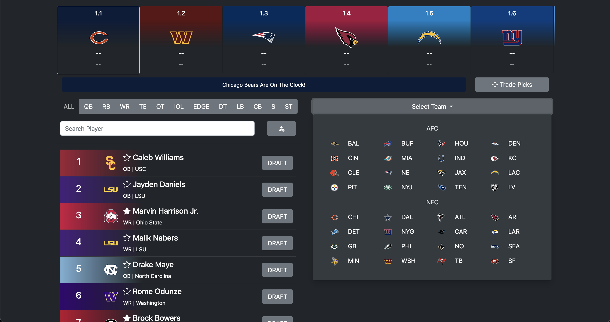
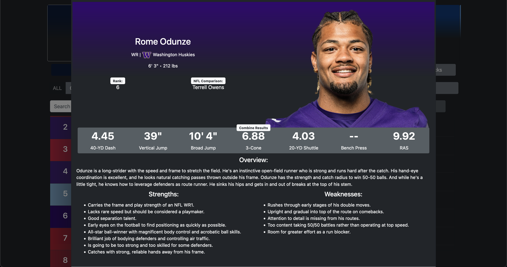

# NFLDraftTracker
2024 NFL Draft Tracker created using Python with Flask and a SQLite Database.

Current features:
- 637 Draft Prospects with measurables, overview, strengths and weakness, and NFL comparison (mostly).
- Response draft board that follows the current pick.
- Responsive prospect search bar.
- Ability to add prospects on the fly, if they do not exist in the tracker already.
- Ability to favorite prospects.
- Ability to trade picks (Only allows picks from 2024 at the moment)
- Ability to view draft picks and needs by team using the Team Control section.

Picture of the overall big board view:

Picture of what is displayed in the Prospect Modal (Completely filled out for the top ~100 prospects):

